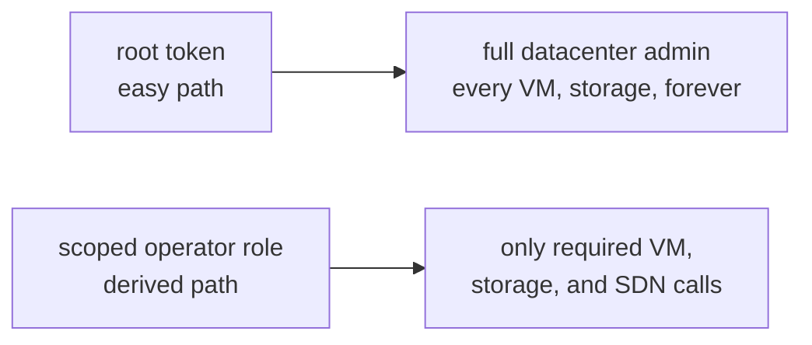
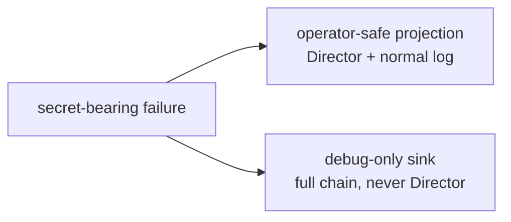
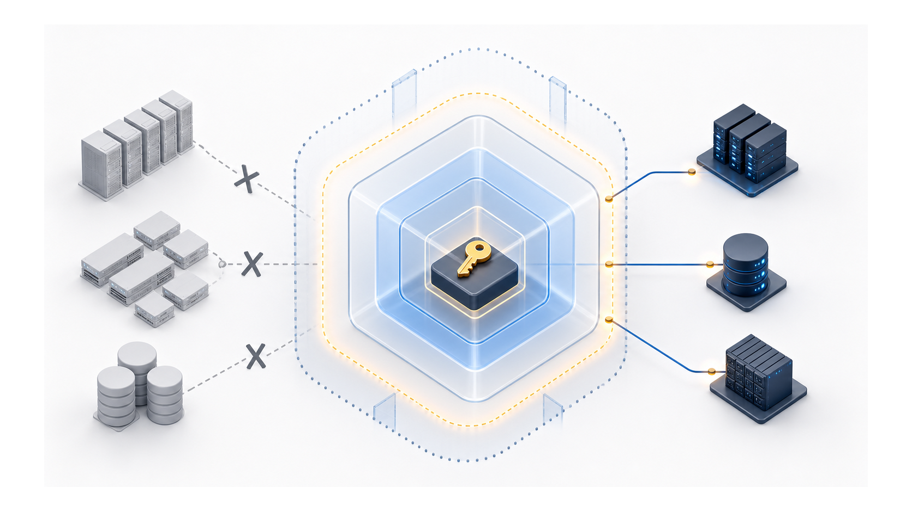

# Chapter 11
## Hostile by Default

*A standing credential's scope is its blast radius.*

<!--
- Framing: every default we ship assumes the credential, the logs, and the extension points are all attack surface.
-->

---

## Least privilege derived from the call graph

- Derived from the call inventory, not guessed
- One cost: locked-VM flag requires literal root, no role grants it
- API token, not password — revocable independently

<!--
- The decision: derive the BoshOperator role's privileges from the handler-by-handler API inventory — every privilege maps to a named CPI call, nothing granted "just in case."
- The split: Sys.Audit comes from the built-in PVEAuditor role on /, so BoshOperator stays focused on VM and storage mutation only.
- The one irreducible cost: delete_vm's skiplock flag (clears locked/running VMs) is gated by PVE to the literal root@pam user — no role or ACL can grant it; a least-privilege bosh@pve will still work on unlocked VMs, just fail on locked ones.
- privsep=0 is safe here because the token inherits a user whose ACL is already minimal — the same setting on a root@pam token is full datacenter admin. Same knob, different trust boundary.
- Bridge-only, no-HA deployments need just VM.* + Datastore.*; SDN.Allocate and Sys.Console stay opt-in for SDN and HA-placement features.
- Gotcha worth pre-empting: import-from's volume form is ACL-gated but NOT root-restricted; only the filesystem path form is root-only, and we never use it — so stemcell upload works under least privilege.
-->

---

## Two trust tiers, two messages

- Logs are a lower-trust tier — scrubbed before writing
- Paths and VM identifiers: not redacted — aid diagnosis
- Retriability classification survives both tiers

<!--
- The decision: redact_logs masks credentials by name — the NATS mbus URL's embedded creds, blobstore secret_access_key/password, and any sensitive-named key become <redacted> while the surrounding structure stays intact for debugging.
- Targeted, not blanket: we deliberately leave paths and VM identifiers in the clear because redacting them would gut diagnosability without buying real protection.
- Payload tracing is opt-in and off by default — when false, no payload trace is emitted at all, so we are not leaking and then scrubbing; the trace only exists when an operator turns it on.
-->

---
class: visual-right
---

## Extension points that assume hostility

- Hooks: zero cost when not configured, zero overhead per deploy
- Host-command: no shell, executable allowlist, scrubbed env, process-group kill on timeout
- Load-balancer: refuses private and loopback addresses by default
- Side channels: best-effort — external dependency never fails the lifecycle

<!--
- The decision: extension points fail safe before they fail useful — an empty pve.hooks list adds zero dispatch overhead, and an unknown hook name fails startup rather than silently doing nothing.
- external_command runs with no shell (args are discrete argv, no interpretation), an absolute-path executable allowlist (empty allowlist = inert), a scrubbed env with an explicit env_passlist, and a hard kill on timeout (default 30 s).
- lb_register's SSRF guard: allow_private_ip defaults false, so an endpoint resolving to a private or loopback address is rejected — set true only on a trusted private network.
- Side channels are best-effort by design: a Data Plane API failure on lb_register is logged and never fails the lifecycle call — an external dependency must not be able to break a deploy.
- Same loud-failure stance in MBus fallback: loopback hosts (127.0.0.1, localhost, ::1, 0.0.0.0) are rejected so the mbus stays empty and the misconfig fails visibly instead of routing to a dead URL.
-->

