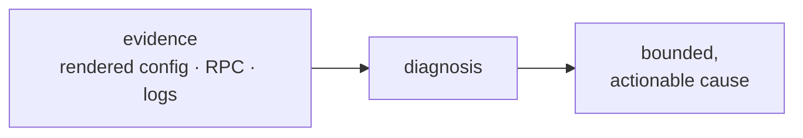
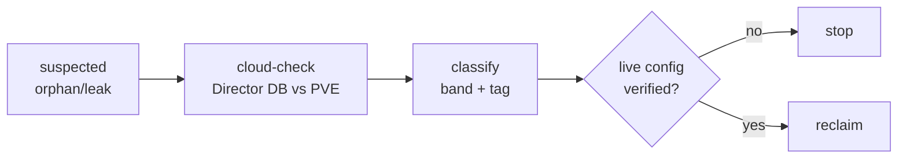
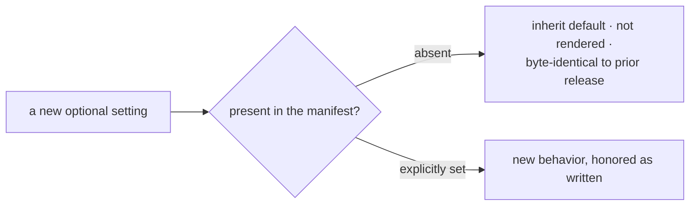

# Chapter 12
## Operating the Thing

*Diagnose from ground truth; push failures left; ownership legible; additivity proven.*

<!--
- Operating in production: we will diagnose from ground truth, catch failures at preflight, make ownership legible for recovery, and prove additivity across upgrades.
-->

---

## Diagnose from ground truth

- Rendered config, not the manifest template
- Retriability flag: separate self-healing noise from structural failure
- The skill is knowing which log lines to ignore

<!--
- Source of truth will be the rendered cpi.json on the Director VM, not the manifest template — and we will set DisallowUnknownFields so a typo there is a hard decode failure, not a silent default.
- ok_to_retry will be the load-bearing flag: storage-lock timeouts and transport faults will surface as RetriableCloudError (Director re-queues); 403, snapshot-guard rejection, and VMID exhaustion will be terminal CloudError.
- "Lines to ignore": `storage lock timeout attempt=N` is normal under 5; `transient transport fault` is just a pvedaemon worker recycle — only act when N routinely approaches 10.
- log_level will be config-only, no runtime env override; JSON/slog, every line will carry request_id and method from the active RPC.
- Error hygiene: Wrap will serialize only the operator-safe msg into the RPC envelope; the full chain (which may carry secrets) stays in the debug log under `pve api error detail`.
-->

---
class: visual-right
---

## Push failures left

- Pre-deploy smoke test: privilege, storage type, bridge, identifier headroom
- Wrong answer costs seconds, not twelve minutes into a deploy
- Boot failure folded into a clean timeout before rollback
- Diagnostic checks fail open — never a new failure mode

<!--
- Preflight smoke test will catch the structural mismatches the runbook enumerates: privsep=0 token, file-based iso_storage and stemcell_storage, bridge UP, import content enabled, VMID headroom — all HTTP-200 curl checks before a deploy commits.
- Wrong answer costs seconds at preflight versus failing twelve minutes into "Creating missing vms" — and some faults only appear there: a host firewall dropping 8006 from the Director's isolated subnet never shows in create-env, only once the in-VM CPI runs.
- health_check.enabled will poll the guest agent after start and fold boot diagnostics into a clean timeout before rollback — opt-in, default off.
- Diagnostic and snapshot checks will fail open by design: require_snapshot_check_pass=false proceeds with a warning; a check never becomes a new failure mode.
-->

---

## Make ownership legible

- Synthetic bands + BOSH tags will turn recovery into a classification
- Disk-audit tool: attached / parked / free-floating / unknown
- Wrong cleanup is data loss — the gate will make it hard

<!--
- Recovery will become classification, not guesswork: BOSH tags (director--/deployment--/job--) plus disjoint synthetic VMID bands — VMs 100–8999, disks 9000–29999, templates 30000–30999, parkers 90000–90999 — will make every resource self-identifying.
- cloud-check will drive reconciliation through the CPI (has_vm/has_disk/get_disks) so the Director, not the operator, picks the safest remediation; run it after any failed deploy, --auto for the safe path.
- scripts/disk-audit will classify every volume attached/parked/free-floating/unknown and exit 1 on any free-floater — but we delete only after cross-checking `bosh disks --orphaned`.
- The gate will exist because the wrong move is irreversible: `qm destroy --purge` destroys every disk in unusedN slots; verify live config first, and a parker VM still holding disks must never be purged.
-->

---
class: visual-right
---

## Index by the symptom

- Runbook indexed by observable symptom, not subsystem
- Duplicate-IP: instances flap on a 15-second cadence, everything else healthy
- Prove the cause (packet capture) before prescribing the fix
- Fix the class: own the address space so collision is impossible

<!--
- The troubleshooting runbook will be deliberately indexed by the symptom we see, not the subsystem — start from the failure, follow diagnosis, apply fix.
- Duplicate-IP is the showcase: an agent connects, runs ~15s, RSTs, reconnects, repeats — while NATS, the firewall, and the VM all measure healthy — caused by a second L2 device answering ARP for a BOSH-assigned address.
- We prove the cause before prescribing: tcpdump the bridge, any IP with two distinct `is-at` answers is the duplicate; the genuine VM's virtio ARP frame is 28 bytes, a physical device's is padded to 46.
- Fix the class, not the instance: own the whole range on an isolated SDN vnet (cpitest0) so no foreign device can claim an address; the cloud-config reserved-list workaround needs a re-scan on every LAN change.
-->

---

## Prove the upgrade changes nothing

- "Absent" and "configured off" are distinct, both correct
- A test will pin the equivalence — additivity proven, not asserted
- CI artifacts: fail open, publish atomically, verify against ground truth

<!--
- Every optional knob will default to "byte-identical to prior releases" — absent means inherit the default and don't render it — so the property surface grows without changing existing behavior.
- "Absent" and "configured off" will be genuinely distinct code paths: operation_timeout.enabled=false is no deadline at all, not a large one — both correct.
- Additivity will be proven by test, not asserted — and the integration harness will verify out-of-band against the live PVE REST API, using membership queries that sidestep PVE's inconsistent 404/500 on per-id GETs, so we assert real cluster state, not just CPI return values.
- The tier model will stack confidence: Tier 0 unit (make check), Tier 1 16-step CPI roundtrip, Tier 2 director create-env + emptyvm smoke, Tier 3 CF deploy — and `integration all` is destructive, so --dry-run first.
-->

