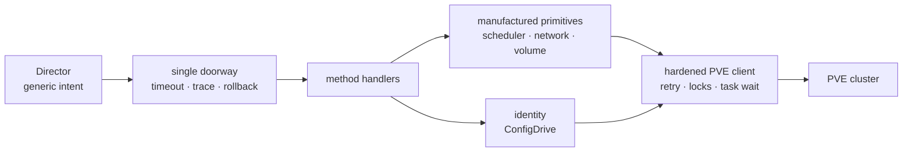
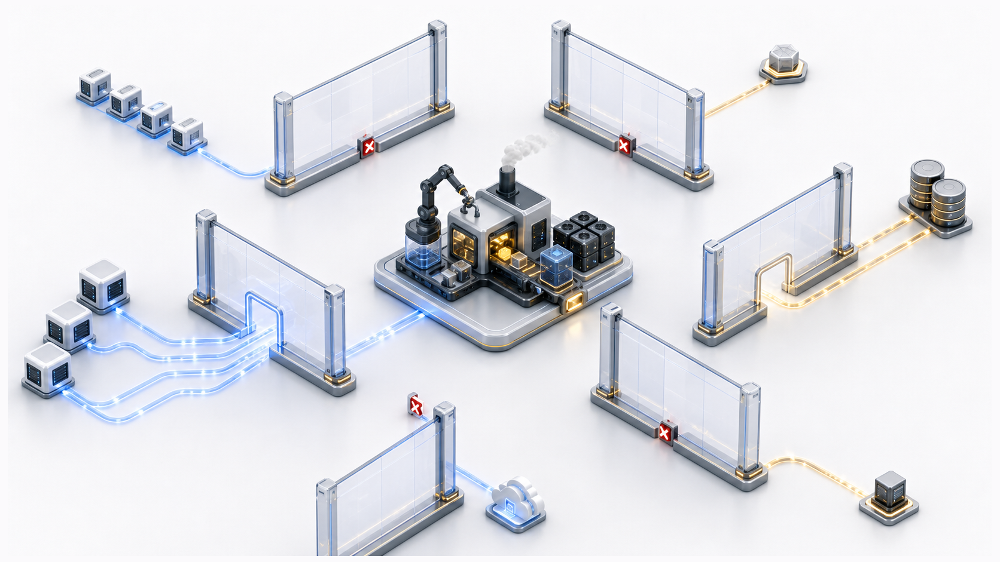

# Chapter 13
## The Whole Picture

*The CPI is a small factory that turns a single-cluster hypervisor into something BOSH can treat like a cloud — stateless and idempotent.*

<!--
- Closing synthesis: tie the four recurring design seams together, then place PVE on the CPI map — it lives in the vSphere/Azure camp, not with the lock-free hyperscalers.
-->

---
class: visual-right
---

## The principles that recur

- Factory, not translator — will manufacture primitives PVE doesn't offer
- Statelessness → every fact lives in a durable carrier
- Locality is the spine: local pins the workload, cluster-global lets it roam
- Fail open or fail closed, chosen per risk to data and placement
- Identity by namespace → lifecycle ownership is a decidable property

<!--
- Factory, not translator: PVE hands us a single-cluster hypervisor; we will manufacture the cloud primitives it never offers — live node scoring, dual anti-affinity, network lifecycle, self-implemented idempotency. Surface coverage is the plan; the work is depth.
- Stateless by construction: the director invokes the binary once per request over JSON-RPC on stdin/stdout — no daemon, no database. Every durable fact rides a carrier: template SHA tag, per-disk perf encoded as base64+JSON in the disk CID, the ConfigDrive ISO.
- Locality is the spine: local storage pins a workload to its node; shared storage lets it roam. That single axis decides stemcell_storage rules and why node-local disk does not move itself.
- Fail open or fail closed, chosen per risk: cleanup and provenance are best-effort (fail open); placement and data guards are strict (fail closed). The physical disk is protected; the convenience record is not.
- Identity by namespace makes ownership a decidable property, not a registry to keep: templates 30000–30999, VMs 100–8999, parkers 90000–90999, lock pools bosh-lock-{key}.
-->

---

## The architecture that will emerge

- Doorway: the one place that knows everything; every call wears the same safety equipment
- Strict one-way dependency — platform blast radius stays small
- Safety concentrated at the edges, not sprinkled through handlers

<!--
- The single doorway is the dispatcher: panic-recover (becomes a RetriableCloud so the director re-drives, never a malformed reply), per-request timeout, secret-redacted tracing, and the rollback stack — every handler wears the same safety equipment without per-handler code.
- Strict one-way dependency is the load-bearing claim: internal/pve will never import internal/agent, and agent will never import cpi. The PVE client knows nothing about agents; agents know nothing about dispatch.
- The one edge that looks like a cycle but isn't: config → hooks → cpi, while cpi does not import config. Hook config structs will live in the hooks package deliberately to keep the graph acyclic — the build will prove it.
- Safety lives in the hardened client, not the handlers: retry, backoff, pushback detection, the cluster pool lock, and task-UPID waiting all concentrate in internal/pve.
- Rollback will be LIFO and idempotent via sync.Once — a half-created VM unwinds VM teardown and LB deregistration together, surviving caller cancel through context-without-cancel.
-->

---
class: visual-right
---

## Where the walls are

- Strict spreading fights HA on a small cluster — genuine tension, surfaced not hidden
- Locked VM needs literal root; no role can grant that flag
- Cleanup and provenance are best-effort — the physical fact is protected, the convenience record is not
- Node-local disk does not move itself — relocation is deliberate operator action
- Storage lock timeout is PVE's wall, not our knob

<!--
- Strict spreading versus HA on a small cluster is a genuine tension we surface, not hide: anti-affinity is a soft scoring penalty (5.0× weight) plus optional cluster-enforced HA rules — strict mode is the operator's call.
- A locked VM needs literal root for skiplock; no custom BoshOperator role can grant that flag. This wall comes from PVE's privilege model, not our design.
- Cleanup and provenance are best-effort by intent: a cross-node SHA sweep GCs orphan templates, but the protected physical disk is the source of truth — the note is convenience, not record of authority.
- Node-local disk does not relocate itself: moving a workload off a node with local storage is deliberate operator action, never a silent CPI migration.
- The storage-lock timeout is PVE's wall, not our knob — a per-storage lockfile serializes every mutation; we will absorb it with StorageLockBackoff (base 2s, cap 30s), but we cannot remove it.
-->

---

## The one-sentence version

**The CPI will be the small, stateless, honest factory that stands on the seam between a general orchestrator and a capable hypervisor, and manufactures on demand every cloud primitive neither side will provide.**

<!--
- Where PVE sits on the map: pmxcfs-replicated HA rules are non-atomic shared config, so PVE needs an explicit cross-process lock — same camp as vSphere and Azure, unlike the lock-free hyperscalers that lean on atomic create, CAS, or idempotency tokens. Do not cargo-cult the cloud CPIs.
- What we will build that PVE lacks: idempotency from scratch (no ClientToken or fingerprint CAS), capability-based sizing, and PVE-aware fault classification that reads Perl die() strings out of UPID task bodies — no reference CPI is this platform-aware because PVE leaks failure as strings, not HTTP codes.
- Coverage is the plan: all 22 canonical CPI v2 methods with real logic plus the update_disk extension, and one of only two CPIs (with vSphere) to implement network lifecycle. Every remaining item is depth within a method, not a new stub.
- The honest close: what's open is deliberate and small — the DHCP and foreign-device half of IP-conflict detection (structurally blocked: PVE-API-only, no host shell), metrics emission, and multi-host API endpoint failover once a second node carries production load.
-->

