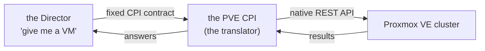

# Chapter 1
## Why We Are Here

*BOSH speaks one generic language; the CPI translates it into Proxmox — and manufactures what Proxmox lacks.*

<!--
- Minutes 0–5. Two things never introduced: BOSH (deploys, watches, heals platforms) and Proxmox VE (the hypervisor our hardware runs). This project is the introduction.
- Set expectations: not a code walkthrough; nobody needs Go. The deliverable is the mental model — what happens on the cluster, what things are called, which settings matter, where to look when it misbehaves.
-->

---

## The driver metaphor

- BOSH = operating system; Proxmox = hardware; CPI = driver
- The Director never says *how* — only what

<!--
- The Director deliberately knows no cloud. It says "give me a VM from this stemcell, on this network, with this much memory" and never how.
- The CPI (Cloud Provider Interface) is BOSH's fixed contract for infrastructure. Swap the driver, the Director never notices — which is why familiar manifests keep working here.
-->

---

## The part that makes this one interesting

- Proxmox VE is **not a cloud**
- No scheduler · no availability zones · no durable volume · no portable network
- AWS CPIs *translate* — this CPI must *manufacture*
- A small factory stamping out missing cloud primitives

<!--
- The central fact of the hour: PVE is a very good hypervisor manager, but the cloud abstractions BOSH assumes simply don't exist on it.
- So this CPI builds a scheduler from live cluster reads, invents fault domains from an operator-written map, and synthesizes durable disks from what PVE does offer.
- The factory image recurs all hour — each of chapters 4–7 is one manufactured primitive.
- Q&A bait: "why not just use the vSphere/OpenStack CPI?" — different APIs, and PVE lacks the primitives those CPIs assume exist.
-->

---

## What we will leave with

- The cast, and what a deploy actually does
- The manufactured machinery: machines, placement, networks, disks
- Configuration: the handful of settings that matter
- Day two: what heals itself, what needs us, where the docs live

<!--
- Four movements. Everything compressed today exists at full depth in docs/ — chapter 10 is the map, so nobody needs to take notes on file names.
-->
