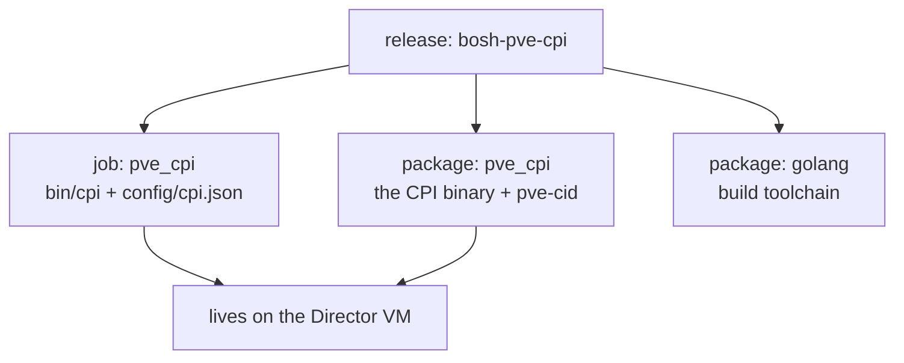

# Chapter 2
## The Cast of Characters

*The CPI is not a service we run — it is a program the Director invokes once per request.*

<!--
- Minutes 5–11. Five players, met once, properly. Two are new to people who know BOSH elsewhere: the cluster and the CPI binary itself.
-->

---

## The five players

- **The Director** — holds the plan, the database, and the only phone line to the CPI
- **The stemcell** — a golden OS image with a dormant agent; stock OpenStack images, unchanged
- **The agent** — wakes inside every VM, phones home, does the Director's bidding
- **The Proxmox cluster** — nodes, storage, bridges; one REST API on port 8006
- **The CPI** — the translator between the two worlds

<!--
- The CPI never opens a shell on a node and never logs into a guest — everything goes through the PVE REST API with one scoped credential. That constraint shapes chapter 4's identity story.
- Stock bosh.io OpenStack stemcells work unchanged; the trick behind that lands in chapter 4.
-->

---

## A program, not a service

- No daemon · no port · no memory between requests
- One request → one process → one answer → exit
- Remembers nothing ⇒ **retrying is always safe**
- One config file, read fresh on every start

<!--
- The Director starts the binary, writes one request, reads one answer, and the process exits. Next request, fresh process, no memory.
- Statelessness is the strength: a failed deploy is rarely a crisis. Re-running is the designed recovery, and running the same request twice never duplicates or destroys.
- Everything the CPI knows comes from the request plus the rendered config file — that file is chapter 8's whole subject, and chapter 9's ground truth.
-->

---

## How it is packaged

- One job, two packages, no running process
- `pve-cid`: read-only decoder for every ID we will meet

<!--
- Standard BOSH release; the job colocates on the Director VM. Compiled hermetically — all dependencies vendored, no network during build.
- The monit file is deliberately directive-free: there is no process to keep alive. That one detail encodes the whole design.
- pve-cid ships at /var/vcap/packages/pve_cpi/bin/pve-cid (not on PATH). Decodes IDs offline, locates disks/stemcells live, never mutates. First tool to reach for when an ID in an error needs to become a real object.
-->
