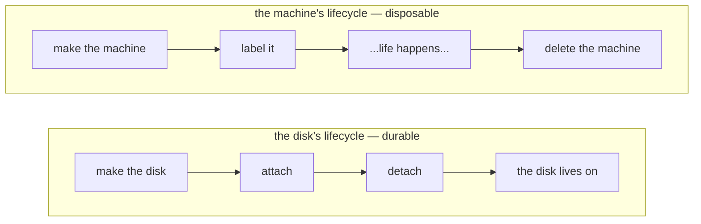

# Chapter 3
## What Happens When We Deploy

*A deploy is a chain of small, safe-to-retry steps — nothing is a leap.*

<!--
- Minutes 11–17. From outside a deploy looks like chaos; underneath it is a long sequence of small named requests the Director sequences itself.
-->

---

## One machine's life

- **Data survives compute** — two lifecycles, kept apart on purpose

<!--
- The biography: image confirmed on cluster → clone, wire, size, start → agent boots and phones home → disks created/attached as separate steps.
- Deleting the machine and deleting its data are different decisions made separately. VMs are disposable (recreated on every stemcell upgrade); persistent disks are handed from old VM to replacement.
- Chapter 7 covers what that promise costs on a platform with no native disk object.
-->

---

## Safe to run twice

- Fails halfway → cleans up → reports honestly → Director retries
- Transient errors marked *retriable* → re-driven automatically
- A failed deploy is usually **waiting, not broken**
- `bosh deploy` again is the intended recovery

<!--
- Every link is built to be retried; create_vm that fails mid-way rolls back what it made.
- The retriable-vs-terminal distinction is the single most useful diagnostic skill — chapter 9 teaches reading it.
- Practical takeaway: calm. Re-running is the design, not a workaround.
-->

---

## Reading the cluster like a book

| VMID range | Species |
|---|---|
| 100 – 8999 | Real VMs |
| 9000 – 29999 | Persistent disks |
| 30000 – 30999 | Frozen stemcell templates |
| 90000 – 90999 | Parker VMs (disk guardians) |

- The band tells the species before anything else
- Tags name Director, deployment, and job

<!--
- Ranges are configurable; the idea is fixed. A "VM" numbered 30412 is a template, not a runaway machine. 9003 is a disk.
- pvesh get /cluster/resources reads like an inventory thanks to the director--/deployment--/job-- tags.
- The chain includes read-back requests (has_vm, get_disks) purely so the Director can compare records to reality — that is what bosh cloud-check drives on day two.
-->
