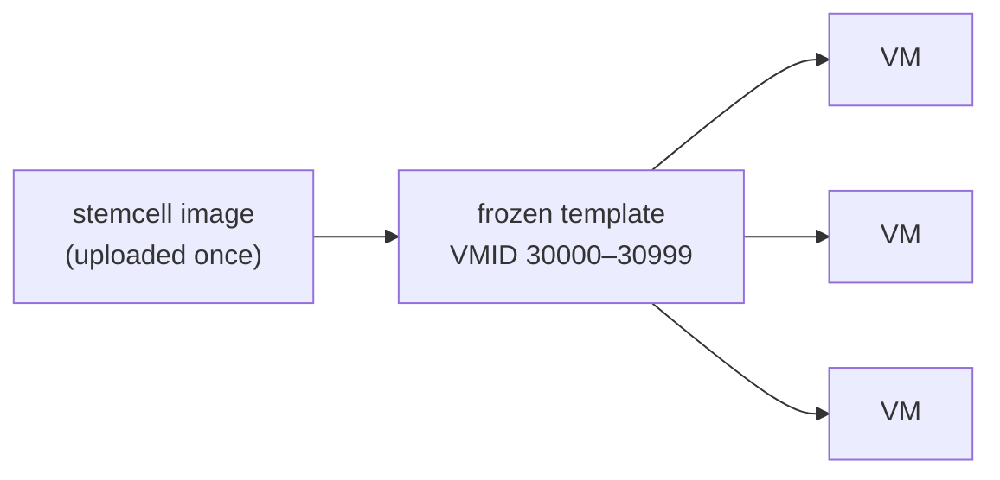
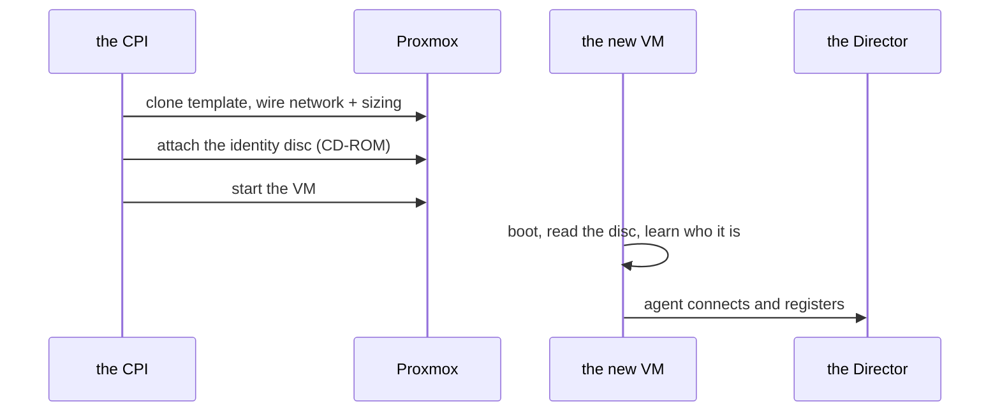

# Chapter 4
## Machines from a Mold

*Pay the image cost once, clone in seconds — then hand each clone its identity on a sealed disc.*

<!--
- Minutes 17–22. Block-copying an OS image takes ~4 minutes; dozens of machines recreated on every upgrade would spend their lives copying the same bytes.
-->

---

## The mold

- Import once, stamp many — 4 minutes → seconds
- Identity by *content* fingerprint, so nothing imports twice

<!--
- The template is a VM that never runs; on copy-on-write storage (NFS, ZFS, thin LVM, Ceph) clones share its blocks.
- Content fingerprint rides as a tag: upload the same stemcell twice — even two Directors racing — and the CPI converges on one template. Deletion is reference-counted across Directors; the fingerprint finds every replica at cleanup.
- Operational notes: stock bosh-openstack-kvm qcow2 line; template storage must be file-based and shared on multi-node; light-stemcell modes skip re-uploading images already on storage (docs/light-stemcells.md).
-->

---

## The sealed envelope

- No login · no SSH · no extra service

<!--
- A fresh clone wakes amnesiac; the CPI cannot log in to fix that (API-only, no shell into guests).
- So identity arrives as data: a read-only config-drive ISO attached as a CD-ROM, read by the guest's stock tooling on first boot. The sealed-envelope image: nobody dictates contents over the phone; the envelope is simply there.
- The disc format is the OpenStack config-drive layout — that is why stock OpenStack stemcells work unchanged, and why no registry service or cloud-init wiring exists for us to maintain.
- The disc stays attached for the VM's life on a reserved SCSI slot, out of reach of data disks.
-->
