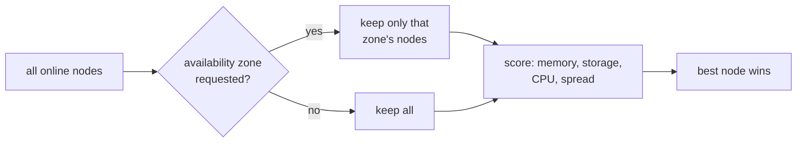

# Chapter 5
## Where Machines Land

*Every placement starts from a fresh, live read of the cluster; the scorer prefers, the operator's map guarantees.*

<!--
- Minutes 22–27. PVE creates a VM wherever we point it — point at one node forever and it stacks the deployment there until the node buckles. First manufactured primitive: a scheduler.
-->

---

## A scorer with fresh eyes



- On by default; fresh read every VM; nothing to install

<!--
- Live read per create: free memory (heaviest — a node out of RAM can't start the guest), storage headroom, CPU, guest count, maintenance flags.
- Siblings of the same instance group are penalized hard, so a job spreads across nodes without any anti-affinity config.
- Escape hatches: cloud_properties.target_node bypasses scoring; placement.enabled: false falls back to the static pve.node.
-->

---

## Availability zones are a map we write

```yaml
placement:
  az_map:
    z1: [pve01, pve02]
    z2: [pve03, pve04]
```

- PVE has no AZs — we invent them as named node groups
- **The trap:** each `vm_type` must also set `availability_zone`

<!--
- Cloud-config AZs now mean genuinely separate hardware — a VM asking for z1 is confined to those nodes before scoring runs.
- The trap deserves the full minute: BOSH does not pass the cloud-config AZ name to the CPI. Without cloud_properties.availability_zone on every vm_type, the zone features are silently inert — VMs create fine, nothing is pinned, and no warning fires in the plain case (only the HA-pinning opt-in logs one per unpinned VM; docs/ha-and-resurrection.md has the wiring). An unknown zone name is a hard error, never a silent fall-through.
-->

---

## Making the decision stick

- Opt-in: write the placement into PVE's HA rule store
- Opt-in: hand restless workloads to PVE's Dynamic Load Balancer
- Shared caveat: **one healer at a time** — resurrector off for HA-managed deployments

<!--
- The CPI places once and exits; PVE HA or a rebalance can silently migrate a VM out of its zone later. pin_az_via_ha_rules records a node-affinity rule so the decision outlives the process.
- DLB (PVE 9.2+) is the opposite trade: continuous rebalancing instead of a fixed home. Needs shared storage and cluster-wide networking.
- Foreshadow chapter 9: once PVE may restart/move machines, BOSH's resurrector must stand down for that deployment or the two healers race and produce duplicates.
-->
