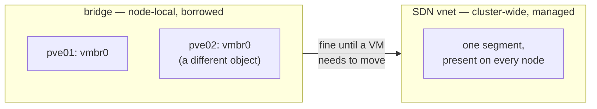

# Chapter 6
## The Network Story

*By default the CPI borrows our networks and touches nothing; asked to manage them, it can build cluster-wide ones. Either way, BOSH must own its address space.*

<!--
- Minutes 27–33. Where most first deployments just work — and where the one truly maddening failure lived. Both halves get their time.
-->

---

## Borrowed and managed

- Default: attach to a named bridge (`vmbr0`), create nothing
- Opt-in: SDN-managed VXLAN vnets that follow the VM anywhere

<!--
- Borrowed is the default and the whole story for most shops: manual networks with static IPs (delivered on the identity disc), dynamic and vip supported, per-NIC vlan tag for trunked bridges.
- A bridge is a per-node object — two vmbr0s are unrelated things sharing a name. A VM placed freely (ch 5) or migrated needs its network to exist everywhere it might land.
- managed: true only hands the network's lifecycle to the CPI; the network mode picks the path. The shipped default builds a plain bridge on one node — the SDN mode (or a zone/vnet named in cloud_properties) is what yields a vnet in a VXLAN zone: same L2 segment on every node. The CPI creates the zone turnkey, derives tunnel peers from live membership, and gates VM attach until the network is actually realized on the target node (committed ≠ real).
- Both modes coexist in one deployment: borrow the office VLAN, manage an isolated overlay.
-->

---

## Own the address space

- One IP, two machines: agents flapped every ~15 s, everything measured healthy
- On a provided network, ownership is an **agreement**: ranges reserved, out of DHCP, in the inventory, outliving any deployment
- Guard rail on by default: duplicate-IP scan — sees our VMs, not foreign devices
- The runbook's flagship entry proves a duplicate in minutes

<!--
- Story in two sentences (the callback, not the retelling): a deployment flapped on a steady ~15 s cadence with every resource healthy; a real device on a shared LAN already held a BOSH-assigned IP, so two machines answered for one address and packets went to the wrong hardware.
- The lesson lands hardest on this room's situation — a network handed to us, not one BOSH builds. A network BOSH doesn't fully own cannot guarantee unique addressing, and nothing above it can be trusted without that.
- The agreement, three parts: BOSH's ranges carved out of every DHCP scope and recorded as ours in the network team's inventory; nothing else ever lives in them, however temporary; the reservation stays even when no VM currently holds an address.
- Guard-rail scope, said honestly: ensure_no_ip_conflicts (on by default) scans the cluster before provisioning a static IP — it catches conflicts among our own VMs, it cannot see a foreign device on the wire. Only the agreement covers those.
- The troubleshooting runbook's flagship entry proves a duplicate in minutes with tcpdump + a ping sweep (chapter 9 points there).
-->
