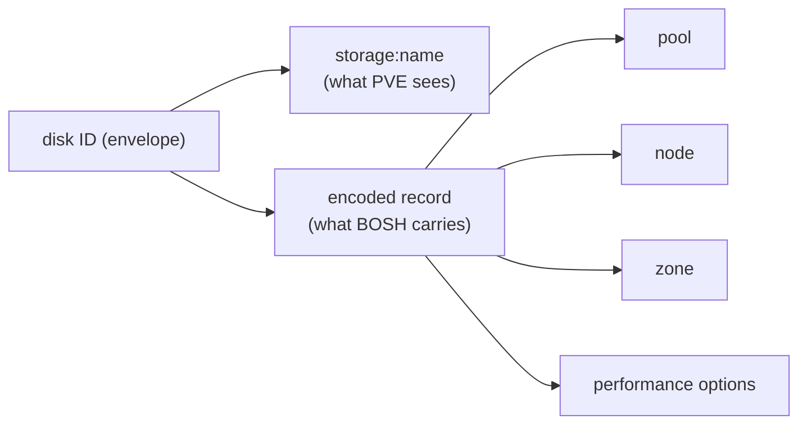
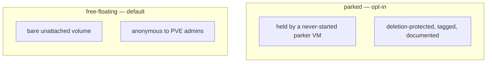

# Chapter 7
## Disks That Outlive Their Machines

*PVE has no durable volume — so the CPI builds one from an ID that carries its own paperwork, a legible namespace, and an optional guardian.*

<!--
- Minutes 33–39. PVE's entire volume identity is a string like nfs-disks:vm-9003-disk-0 — no metadata, no tags, no ownership. The richest invention in the CPI.
-->

---

## The identifier that carries its own paperwork

- Long opaque IDs are envelopes — `pve-cid decode` opens them
- The 9000–29999 band guards against wrong deletion

<!--
- The platform won't store identity, so it rides inside the ID the Director already never loses. Paperwork travels with the disk; nothing needs remembering.
- pve-cid decode 'pvd-…' turns any ID from an error message into pool + node + volume name.
- The synthetic VMID band is load-bearing safety: deletion guards distinguish a persistent disk from a VM's scratch disks by band, and refuse to destroy data they can't prove is disposable.
-->

---

## The detach window, and the coat-check

- Audit habit: `scripts/disk-audit` classifies every disk, stable exit codes

<!--
- Between machines, a detached disk is safe from BOSH but anonymous to a PVE admin browsing storage — a tidy human or cleanup script might delete it.
- The parked opt-in is a coat-check: each detached disk hangs on a parker VM (90000–90999 band, never started, protection=1 so PVE itself refuses deletion, provenance note recording which disk/from which VM/when).
- disk-audit: attached / parked / free-floating / unknown across all nodes; exit 1 on free-floating — works as a CI gate or a monthly habit.
- Rule of thumb before deleting anything lonely-looking: bosh disks --orphaned first. A disk the Director tracks is not an orphan.
- Performance settings (cache, iothread, throughput caps) ride in the envelope too; defaults auto-resolve from the storage backend.
-->
