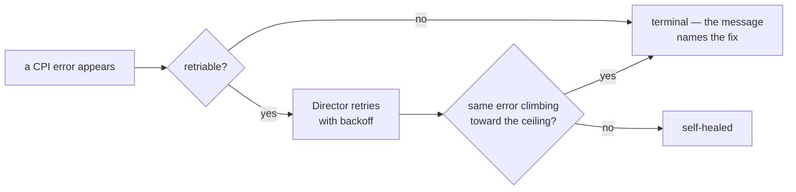

# Chapter 9
## When Things Go Wrong

*Every error says whether it will heal itself; the skill is spotting the few that will not — and starting from ground truth.*

<!--
- Minutes 46–52. Built for the 3am person with an error string, a hung task, and no appetite for source code.
-->

---

## The one distinction that does most of the work

- The skill is knowing which lines to **ignore**

<!--
- Retriable = the platform being a hypervisor: storage locks, busy API workers, network blips. The Director re-drives with backoff; a handful of retry lines is the resilience layer working.
- Terminal = structural: missing permission, misconfigured pool, exhausted VMID range. The message names the fix.
- The escalation rule: occasional retries, ignore; the same retriable error climbing relentlessly toward its ceiling, treat as structural.
-->

---

## Where truth lives

- `bosh task <id> --debug` — the full story, every request and response
- `/var/vcap/sys/log/bosh/cpi/pve.log` — the CPI's own log
- `/var/vcap/jobs/pve_cpi/config/cpi.json` — what the binary *actually* read
- `bosh cloud-check` — reconcile records with reality after any failed deploy
- Runbook indexed by **symptom**, not subsystem

<!--
- Diagnose from what the system consumed, never from the manifest — the rendered cpi.json settles "but I configured X" arguments.
- The runbook's flagship entry is chapter 6's flapping-agent story with the packet-capture proof procedure.
- cloud-check before re-deploying after a failure — it is the tool built for exactly that moment.
- Optional numbers: a per-request metrics file (one JSON line per call) and full OpenTelemetry tracing. Both off by default; both fail open — a dead collector can never break a deploy.
-->

---

## One healer at a time

| | Recovery owner | Our action |
|---|---|---|
| Default | BOSH resurrector | Nothing |
| HA features opted in | Proxmox HA | `bosh update-resurrection off` |

- Two healers race → duplicate machines fighting over an address

<!--
- Out of the box: zero HA registrations, BOSH alone heals, no conflict possible.
- Opting into ch 5's HA-backed features makes Proxmox a healer too: it relocates the existing guest while the Director independently builds a replacement — both succeed, and the duplicates conflict on IP and identity.
- One sentence to remember: for any deployment, exactly one system owns recovery. The CPI warns on the risky combination; docs/ha-and-resurrection.md has the ownership matrix and measured failover timings.
-->
