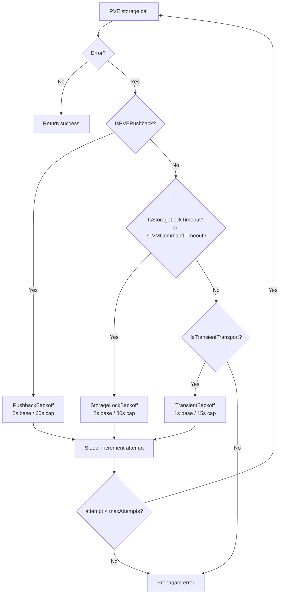

# PVE Per-Storage Lockfile Behavior

This document covers how Proxmox VE serialises storage operations behind a per-storage lockfile, what failure mode that produces under bursty concurrent CPI calls, and the two locking mechanisms the CPI uses to absorb it.

## What PVE does

PVE protects every mutation against a single storage pool with an exclusive lockfile at:

```
/var/lock/pve-manager/pve-storage-<storage-name>
```

The lock is acquired by `pvesm` (the storage manager) and the QEMU helpers (`qm`, `qemu-img`) whenever they need to allocate, free, resize, snapshot, or import a volume on that storage. Any other caller racing for the same lock waits up to the storage timeout (default ~30 s) and then fails the task.

There is one lockfile per storage. Operations against different storages do not contend with each other.

## Operations that take the lock

Empirically observed (PVE 9.x; same applies back to 7.x):

- `pvesm alloc` / `pvesm free` — volume create and delete.

- `qm importdisk` / `qm create … --scsiN <storage>:0,import-from=…` — stemcell import.

- `qm resize` — grows or shrinks a backing volume via `qemu-img resize`.

- `qm snapshot` / `qm delsnapshot` — snapshot create and delete on zfs, lvm, lvmthin, btrfs.

- `qm destroy --destroy-unreferenced-disks` — VM deletion that frees attached volumes.

- `pvesm upload` (multipart POST under the API, but the resulting storage task takes the lock too) — ISO and stemcell uploads.

The following do **not** take the lock:

- `qm set` editing config keys like `scsiN: <vol>,size=…` (pure config-file PUT, no storage call). This is why `attach_disk` and `detach_disk` do not contend.

- `nodes/{node}/qemu/{vmid}/config` reads.

## How the failure surfaces

A loser on the lock returns a task failure like:

```
task failed: can't lock file '/var/lock/pve-manager/pve-storage-data' - got timeout
```

The task is reported as failed (not running, not retried by PVE). The CPI sees this as either a synchronous error from the SDK call or a non-zero exit status when awaiting the task UPID.

The substring match `"can't lock file" && "got timeout"` is the canonical detector; `pve.IsStorageLockTimeout` implements it case-insensitively.

### IsLVMCommandTimeout

`IsStorageLockTimeout` is a superset that also catches LVM userspace tool timeouts. PVE shells out to `/sbin/lvs`, `/sbin/lvcreate`, `/sbin/lvremove`, and similar tools during `qm resize` / `qmcreate` / `qmdestroy` on LVM-thin storage. Under concurrent VG activity, any one of these tools can stall against the LVM metadata daemon, and PVE's command wrapper kills it after its internal deadline. The canonical surface is:

```
task failed: command '/sbin/lvs --separator ... /dev/data/vm-N-disk-0' failed: got timeout
```

`IsLVMCommandTimeout` matches `"failed: got timeout"` anchored to `/sbin/lv` or `/sbin/vg` in the error string to avoid false positives from unrelated command timeouts. Both lockfile and LVM surfaces are transient storage-backend contention — same seconds-scale backoff applies to both.

## When the CPI hits it

A BOSH director driving a Cloud Foundry deploy can launch a dozen or more concurrent `create_vm` calls within a second of each other. Each runs as a separate OS process (one `bosh-pve-cpi` invocation per VM), so in-process serialisation does nothing. The director's worker pool is the only knob, and it defaults wide.

Observed contention points, in deploy-time order:

1. **Stemcell upload** (`create_stemcell` → `Storage().Upload` → task). One-shot per stemcell; a single deploy rarely triggers more than one, but a bosh-bootloader-style rebuild with multiple stemcells will.

2. **VM create + import** (`create_vm` → `QEMU().Create` with `import-from`). One per VM. The qcow2 stemcell is copied into the target VM storage under the lock; latecomers time out.

3. **Root-disk resize** (`create_vm` → `ResizeDisk(virtio0)`). One per VM that requests `disk` > stemcell base. Hits the same lock as the import that just finished, against the same storage.

4. **Persistent-disk create** (`create_disk` → `Storage().CreateVolume`). One per job instance with a persistent disk.

5. **ConfigDrive upload** (`agent/configdrive` → `Storage().Upload` → task). One per VM. Uploads to the ISO storage, which may be the same or different from the VM storage; if the same, this stacks on top of the import + resize burst.

6. **VM/disk delete** (`delete_vm`, `delete_disk`). On scale-down or redeploy. `delete_vm` passes `destroy-unreferenced-disks=true` only when `pve.destroy_unreferenced_disks` is enabled (default false) and the VM is not being retained; with the default, the destroy frees only volumes referenced in the VM's own config.

## The retry strategy

This CPI implements storage-lock retry in `internal/pve/retry.go`:

- `pve.IsStorageLockTimeout(err)` — substring predicate on the SDK error message; also covers `IsLVMCommandTimeout`.

- `pve.StorageLockBackoff(attempt)` — exponential `2 s × 1.5^attempt` with ±30% jitter, hard-capped at 30 s.

- `pve.RetryOnTransientOrLock(ctx, logger, label, maxAttempts, op)` — invokes `op` up to `maxAttempts` times (default 10), retrying on `IsStorageLockTimeout`, `IsTransientTransport`, or `IsPVEPushback`. Other errors propagate immediately. Context cancellation short-circuits the sleep.

At default settings, a worst-case run exhausting all retries waits roughly `2 + 3 + 4.5 + 6.75 + 10.1 + 15.2 + 22.8 + 30 + 30 = 124 s` before giving up — well inside BOSH's task timeout but long enough for any reasonable lock holder to finish.

### Where the helper is wired

All storage-touching call sites use `RetryOnTransientOrLock`, which combines pushback, transient-transport, and storage-lock predicates. Operators will therefore see `reason=storage_lock`, `reason=transient_transport`, or `reason=pushback` in CPI logs for the same operations, depending on which condition fired.

| Surface | Operation wrapped | Also retries |
|---------|-------------------|--------------|
| `create_vm` | initial `Create+import` (via `AllocateWithRetry`); `ResizeDisk(virtio0)` + await | transient_transport, pushback |
| `create_disk` | `CreateVolume` inside `AllocateDiskWithRetry` callback | transient_transport, pushback |
| `delete_disk` | `DeleteVolume` | transient_transport, pushback |
| `resize_disk` | `ResizeDisk` + await | transient_transport, pushback |
| `delete_vm` | `DeleteQemu` (`DestroyUnreferencedDisks` only when `pve.destroy_unreferenced_disks` is true; default false) | transient_transport, pushback |
| `create_stemcell` | `Storage().Upload` + await (file handle reopened per attempt) | transient_transport, pushback |
| `delete_stemcell` | `DeleteVolumeIfExists` | transient_transport, pushback |
| `snapshot_disk` | `Snapshot` + await | transient_transport, pushback |
| `delete_snapshot` | `DeleteSnapshot` | transient_transport, pushback |
| `update_disk` | `ResizeDisk` on the resize path (cache/iothread-only changes skip storage I/O) | transient_transport, pushback |
| `agent/configdrive` | `Upload` + await (file reopened per attempt), `DeleteVolume` | transient_transport, pushback |

`attach_disk` and `detach_disk` are not wrapped — they only mutate VM config and never touch the storage lock.

### Streaming upload note

For multipart uploads (`Storage().Upload`), the request body is a single-use `io.Reader`. A retry must reopen the source from its on-disk path so PVE sees a fresh stream each attempt. Both `uploadStemcellImage` and `agent/configdrive.uploadISO` do this — the `os.Open` lives inside the retry callback.

### Queued-imgdel hazard

PVE's `DELETE /nodes/{node}/storage/{storage}/content/{volume}` does not run the delete inline; it queues an `imgdel` task under the same per-storage lockfile and returns the task UPID. Under heavy contention the queued imgdel can sit waiting for the lock for several seconds — long enough for the caller to issue an `Upload` to the same filename, win the lock first, and finish. Then the queued imgdel grabs the lock and removes the freshly-uploaded volume.

We observed this exact race against `vm-117-config.iso`:

```
14:44:09  imgcopy  vm-117-config.iso        (upload completes)
14:44:11  qmstart  117                       (config references local:iso/vm-117-config.iso)
14:44:17  imgdel   vm-117-config.iso        (queued from earlier pre-delete; finally got lock)
14:44:17  qmstart  failed: volume 'local:iso/vm-117-config.iso' does not exist
```

The fix is in the SDK and CPI: `Storage().DeleteVolumeAsync` and `Storage().DeleteVolumeIfExistsAsync` (from `pve-apiclient-go`) return the imgdel UPID. The CPI's `agent/configdrive` pre-delete now awaits that UPID before uploading, so a queued imgdel can never fire mid-create. Same wiring applies to `delete_disk` and `create_disk`'s rollback paths.

## Cluster Pool Advisory Lock

A second locking mechanism operates at a higher level than the OS lockfile. `AcquireClusterLock` acquires a cross-process advisory mutex via PVE resource pool membership.

**Mechanism:** PVE's `POST /pools` is serialised by pmxcfs and rejects a duplicate poolid with a conflict error. That create-or-fail behavior is a test-and-set: the process that creates the sentinel pool holds the lock; concurrent processes wait, or steal if the recorded expiry has passed. The sentinel poolid is named `bosh-lock-{key}` (e.g., `bosh-lock-aa-web`) to avoid colliding with operator pools.

**Purpose:** Anti-affinity membership updates are serialised by `AcquireClusterLock` when `pve.cluster_lock_mode` is enabled. Without this lock, two concurrent `create_vm` calls can both read the anti-affinity group membership, both choose the same node as the least-loaded candidate, and both write membership back — a classic TOCTOU race. The cluster lock serialises the read-modify-write so each `create_vm` sees a consistent membership state.

**Lock ownership:** The sentinel pool comment records the owner and expiry as `"owner=<token> exp=<unix-seconds>"`. If a CPI process crashes while holding the lock, any waiter whose recorded expiry has passed steals it via delete-and-recreate. Post-steal owner verification confirms the stealing process actually won before granting the handle.

**Release:** `ClusterLockHandle.Release` deletes the sentinel pool. The call is idempotent: a second call is a no-op, and a not-found pool is treated as success.

**Config:** `pve.cluster_lock_mode` enables the mechanism; `pve.cluster_lock_timeout_sec` bounds total wait time. On timeout, the error is `TypeRetriableCloud` so the BOSH director re-drives the operation.

For further depth on placement and anti-affinity, see [DLB-Aware Placement](dlb-aware-placement.md).

### Storage-lock retry flow



## Operator-side knobs

The CPI's retry absorbs short bursts. If deploys consistently exhaust the retry budget, the contention is structural. Three options:

1. **Throttle the director.** `director.workers` and per-instance-group `max_in_flight` cap concurrent `create_vm` calls. Cutting this to half the PVE node's vCPU count usually flattens the burst enough.

2. **Split storages.** Putting stemcells on one PVE storage and VM root disks on another removes contention between import and resize, because they grab different lockfiles. The CPI supports this via `pve_stemcell_storage` vs `pve_vm_storage` in `vars.yml`.

3. **Tune retry attempts.** `pve.retry.storage_lock.max_attempts` (default 10) bounds the storage-lock retry count for `create_disk`. Raising it lets you ride out longer lock holds at the cost of slower failure when something is genuinely stuck. `pve.retry.storage_import.max_attempts` is honored as a legacy fallback when `storage_lock` is unset, preserving existing deployments.

## Diagnosing

In the director's CPI log (`/var/vcap/sys/log/cpi/cpi.log`):

```
pve: retrying after retryable fault op=create_disk reason=storage_lock attempt=1 max_attempts=10 backoff_ms=1837 error="..."
```

Nonzero retry log lines on a deploy that ultimately succeeds mean the mechanism is working as intended. Watch the `attempt` value — if it routinely climbs above 5, the lock holder is taking long enough that options 1 or 2 above warrant attention.

`attempt=10` followed by the operation failing means retries were exhausted. Look at the PVE node's `journalctl -u pvedaemon -u pveproxy` from the same window to see what was holding the lock.

## Related failure mode

Per-storage lock contention is the first transient PVE failure the CPI handles; pvedaemon worker recycling and HTTP 429 pushback are the second. The two often coexist on the same call sites, absorbed by the same helper (`RetryOnTransientOrLock`). See [PVE Transient Transport Faults](pve-transient-transport.md) for the worker-recycle and pushback sides.

## References

- `internal/pve/retry.go` — helper implementations: `StorageLockBackoff`, `RetryOnStorageLock`, `RetryOnTransientOrLock`.

- `internal/pve/error_map.go` — `IsStorageLockTimeout`, `IsLVMCommandTimeout` predicates.

- `internal/pve/cluster_lock.go` — `AcquireClusterLock`, `ClusterLockHandle`, `ClusterLockPoolName`.

- `internal/cpi/handlers/create_vm.go` — `createVMRetryBackoff` (per-error backoff routing) and `AllocateWithRetry` wiring.

- PVE source (for the curious): `/usr/share/perl5/PVE/Storage/Plugin.pm` `lock_storage()` — the canonical lock acquisition site.
