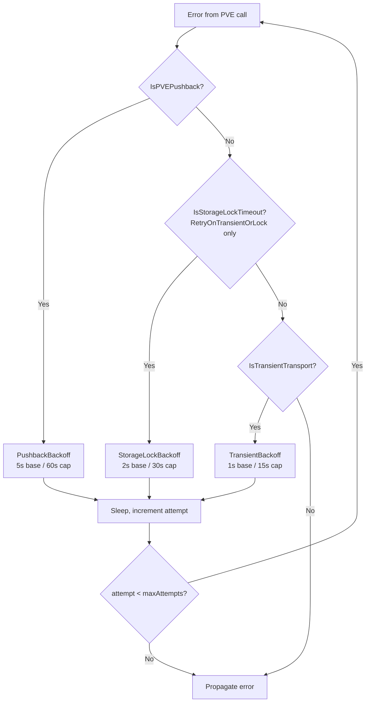

# PVE Transient Transport Faults

This document covers how the CPI absorbs pvedaemon worker recycling, pveproxy backend stalls, HTTP 429 pushback, and the auth-ticket EOF that follows. Related: [PVE Storage Locking](pve-storage-locking.md) covers the per-storage lockfile class.

## What PVE does

`pvedaemon` runs a fixed pool of HTTP workers (default 3) behind `pveproxy`. Each worker has a built-in **per-worker request quota** plus a soft memory limit; when either is hit, the worker exits cleanly and the parent respawns a fresh one. Every in-flight TCP connection to the exiting worker is dropped without an HTTP response.

The shape pveproxy returns to the client depends on where the worker died:

- **Mid-response** → empty body and a TCP RST. SDKs that expect JSON report it as `EOF` or `failed to parse response`.

- **Before accepting the request** → pveproxy retries the backend, fails to connect, and emits its non-standard **HTTP 596** ("backend gone") to the client.

- **During TLS handshake** → SDK reports `connection refused` or `tls: read on closed connection`.

## How the failure surfaces

Three distinct error strings show up in CPI logs:

```
API request failed: HTTP 596 (code: 596)
```

```
auto-login failed: authentication failed: failed to parse login response: EOF
```

```
operation get-config timed out after 30s
```

The first hits any API call. The second is specific to `POST /access/ticket` — the SDK's first call on a new connection requiring a fresh ticket. The third is the SDK's `TimeoutError` wrapper.

The substring detector `pve.IsTransientTransport` covers all three (plus generic `*ConnectionError` and any 5xx).

## When the CPI hits it

A BOSH director driving a Cloud Foundry deploy launches a dozen or more concurrent `create_vm` calls within a second. With 3 pvedaemon workers, the ratio of in-flight requests to workers is ~10:1, so a worker recycle during the burst window is statistically guaranteed — once every few hundred requests in the field.

Observed at Task 343 (cf deploy retry):

```
13:15:44 pve pvedaemon[5599]: worker 1072563 finished
13:15:44 pve pvedaemon[5599]: starting 1 worker(s)
13:15:44 pve pvedaemon[5599]: worker 1106002 started
```

Two in-flight `create_vm` POSTs riding worker 1072563 died at exactly that timestamp — one with HTTP 596 (POST never reached the new worker), one with auth-EOF (login response truncated).

## The retry strategy

The CPI absorbs the recycle window with a predicate, exponential backoff, and a bounded attempt count. Worker restart is sub-second, so the transient backoff curve is tighter than the storage-lock one: `1s × 1.5^attempt`, ±30% jitter, capped at 15s, default 8 attempts.

`RetryOnTransient` retries on **two** predicates:

- `IsTransientTransport` — pvedaemon worker cycle, 5xx, connection errors (see predicate surface below).
- `IsPVEPushback` — HTTP 429 and PVE phrase set (see [HTTP 429 / PVE Pushback](#http-429--pve-pushback)). When pushback fires, the CPI uses `PushbackBackoff` (5s base, 60s cap) instead of the standard transient curve. The log field is `reason=pushback`.

`RetryOnTransientOrLock` extends this further by also retrying `IsStorageLockTimeout` errors. All storage-touching handler call sites use `RetryOnTransientOrLock`; non-storage call sites use `RetryOnTransient`.

Implementation lives in `internal/pve/retry.go`:

- `pve.IsTransientTransport(err)` — predicate over `sdkerrors.ErrServer`, `*ConnectionError`, `*TimeoutError`, `net.Error.Timeout()`, and the substrings `"failed to parse login response"`, `"auto-login failed"`, `"(code: 596)"`, `"http 596"`.

- `pve.TransientBackoff(attempt)` — 1s × 1.5^n, ±30% jitter, cap 15s.

- `pve.RetryOnTransient(ctx, logger, label, maxAttempts, op)` — retries on `IsTransientTransport` or `IsPVEPushback`. Default `maxAttempts` is `DefaultTransientMaxAttempts` (8).

- `pve.RetryOnTransientOrLock(ctx, logger, label, maxAttempts, op)` — combines all three predicates with per-attempt backoff selection. Default `maxAttempts` is `DefaultStorageLockMaxAttempts` (10).

### HTTP 429 / PVE Pushback

PVE returns HTTP 429 when the node's task queue is full or resource contention is detected. Plain-text task-body errors also carry pushback signals via a conservative phrase set:

- `"too many requests"`
- `"worker busy"`
- `"worker pool"`
- `"unable to acquire lock"`
- `"lock-acquire timeout"`
- `"got timeout"`

The `IsPVEPushback` predicate matches HTTP 429 responses first (via `*sdkerrors.APIError.HTTPCode == 429`), then the phrase set case-insensitively. When it fires, the CPI applies `PushbackBackoff` with base=5s, cap=60s — longer than `StorageLockBackoff` (2s/30s) because worker-pool saturation takes longer to drain than a single per-storage lock hold.

Operator knobs: `pve.retry.pushback.base_ms` and `pve.retry.pushback.cap_ms` in the BOSH manifest control the backoff bounds. `ConfigurePushbackBackoff` reads these at startup and stores them process-wide.

**Note on phrase overlap:** the `"got timeout"` phrase also appears in storage-lock errors (`"can't lock file … got timeout"`), so `IsPVEPushback` is a superset of `IsStorageLockTimeout` for plain-text errors. Both return true for the same lock-timeout string. In `RetryOnTransientOrLock`, pushback takes priority and applies the longer `PushbackBackoff` curve.

### max_inflight_per_node semaphore

An additional concurrency gate operates above the retry layer. When `pve.max_inflight_per_node` is set to a positive integer, the CPI acquires a per-node counting semaphore slot before issuing any mutating API call on that node. The semaphore is backed by a buffered channel (`nodeInflightRegistry` in `internal/cpi/handlers/inflight.go`) keyed by PVE node name. This caps the burst rate to PVE — reducing both worker-recycle and pushback frequency at the source rather than absorbing them with retries.

### Retry decision flow



### Where the helpers are wired

| Surface | Wrapper | Reason |
|---------|---------|--------|
| `vmid.listClusterVMIDs` | `RetryOnTransient` | `GET /cluster/resources` runs before every VMID allocation; an auth-EOF here aborts `create_vm` before any work. |
| `vmid.listStorageVMIDs` | `RetryOnTransient` | Same as above for the disk-VMID storage scan. |
| `create_vm.AllocateWithRetry` callback | `IsTransientTransport` added to `isRetryable` predicate; `cleanupVM` runs on both create-error and await-error transient branches. | A 596 mid-POST may leave the VMID partially registered; sweep before next attempt. |
| `create_vm` resize-virtio0 | `RetryOnTransientOrLock` | Resize can hit storage lock or worker cycle. |
| `create_disk` CreateVolume | `RetryOnTransientOrLock` | Same dual exposure. |
| `delete_vm`, `delete_disk`, `delete_stemcell`, `delete_snapshot` | `RetryOnTransientOrLock` | Storage mutations on the cleanup path. |
| `resize_disk`, `snapshot_disk` | `RetryOnTransientOrLock` | Storage mutations. |
| `create_stemcell` upload, `agent/configdrive` upload/delete | `RetryOnTransientOrLock` | Streaming uploads need file reopen inside the callback; pattern already in place. |
| `attach_disk`, `detach_disk` | `RetryOnTransient` (no lock) | Pure config PUT, no storage lock, but worker cycle still applies. |

## Diagnosing

In `/var/vcap/sys/log/cpi/cpi.log` on the director, retries from `RetryOnTransient` or `RetryOnTransientOrLock` appear as:

```
pve: retrying after retryable fault op=create_vm reason=transient_transport attempt=1 max_attempts=8 backoff_ms=1185 error="..."
pve: retrying after retryable fault op=create_disk reason=pushback attempt=2 max_attempts=10 backoff_ms=7312 error="..."
pve: retrying after retryable fault op=create_disk reason=storage_lock attempt=3 max_attempts=10 backoff_ms=4218 error="..."
```

The `reason` field identifies which predicate fired. Watch the mix during a deploy:

- All `storage_lock` → storages saturated; split or throttle (see [PVE Storage Locking](pve-storage-locking.md)).

- All `transient_transport` → pvedaemon worker pool too small for the burst rate.

- All `pushback` → PVE task queue saturated; reduce `director.workers` or lower `pve.max_inflight_per_node`.

- Multiple reasons interleaved → multiple bottlenecks active; the storage-lock side dominates wall time, so address it first.

On the PVE node:

```
journalctl -u pvedaemon --since '<deploy-start>' --until '<deploy-end>' | grep -E 'worker .* finished|starting 1 worker'
```

Worker-cycle events should be visible at exactly the failed timestamps in the CPI log. One cycle per failure is the smoking gun.

## Operator-side knobs

The CPI's retry absorbs typical recycle windows. If retries routinely climb past attempt 4, the worker pool is undersized for your deploy concurrency:

1. **Raise pvedaemon worker count.** Edit `/etc/default/pvedaemon`:

   ```
   MAX_WORKERS=8
   ```

   Then `systemctl restart pvedaemon`. Each worker is ~80 MB resident; eight workers are fine on any PVE host with 8+ GB RAM.

2. **Raise pveproxy worker count similarly.** `/etc/default/pveproxy` `MAX_WORKERS=8`, `systemctl restart pveproxy.service spiceproxy.service`.

3. **Cap per-node concurrency.** Set `pve.max_inflight_per_node` in the BOSH manifest to a value at or below your pvedaemon worker count. This prevents burst saturation at the source.

4. **Tune pushback backoff.** `pve.retry.pushback.base_ms` and `pve.retry.pushback.cap_ms` adjust how aggressively the CPI backs off under HTTP 429. Higher values reduce retry storms; lower values recover faster when the pushback is short-lived.

5. **Throttle the director.** Lower `director.workers` or per-instance-group `max_in_flight`. Cheapest if you cannot edit the PVE node, and also helps with storage-lock contention.

See [PVE Host Tuning](pve-host-tuning.md) for full sizing guidance, verification, and the related storage-side knobs.

## References

- `internal/pve/retry.go` — helper implementations: `TransientBackoff`, `PushbackBackoff`, `RetryOnTransient`, `RetryOnTransientOrLock`.

- `internal/pve/error_map.go` — `IsTransientTransport`, `IsPVEPushback`, `IsStorageLockTimeout` predicates.

- `internal/pve/pushback_seam.go` — `ConfigurePushbackBackoff` and `pushbackDefaults` process-wide seam.

- `internal/cpi/handlers/inflight.go` — `nodeInflightRegistry` per-node semaphore.

- `internal/cpi/handlers/create_vm.go` — `isRetryable` composing all three predicates and per-attempt rollback wiring.

- PVE source (for the curious): `/usr/share/perl5/PVE/Daemon.pm` `finish_workers()` — the worker-recycle path.
